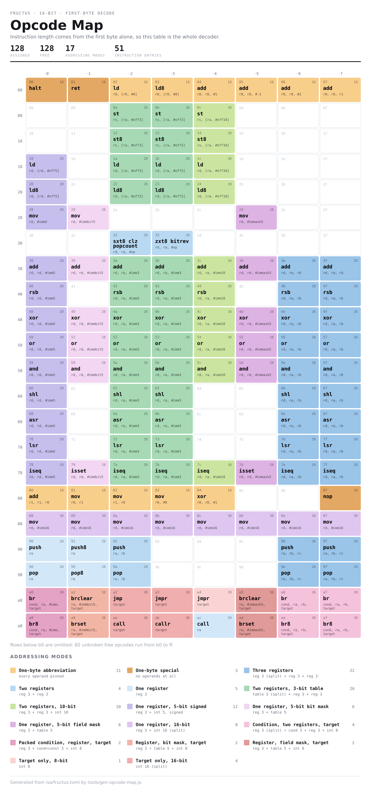

# Fructus

A 16-bit retrocomputer instruction set, and the toolchain that keeps it honest.

Eight registers, byte-granular instructions of one to three bytes, no carry
flag, no condition codes, and a 64 KiB address space. It is meant to run on the
kind of machine a 6502 ran on — a narrow memory bus where every instruction byte
is a cycle you pay for — so the design question behind almost every decision in
here is *what does this cost in bytes*.

Right now: **82 encoding forms over 110 of the 256 first bytes, 146 free.**



Both this and an interactive version with per-cell tooltips come from
`npm run map`.

## The one idea

[`isa/fructus.toml`](isa/fructus.toml) is the single source of truth. It holds
every encoding, every operand type, and what every instruction *does*. The
assembler, the decoder and the simulator are all generated from it or driven by
it, so none of them can drift away from the spec or from each other.

It is also, deliberately, a document. The file is about two thirds prose: what
each decision cost, what was rejected, and why. If you only read one thing, read
that file top to bottom.

The one hand-maintained view left in it — the opcode map in the header comment —
is checked against the encodings below it by `npm run check`, because it had
already drifted once and nothing caught it.

## Quick start

You need [customasm](https://github.com/hlorenzi/customasm) (Rust, Apache-2.0)
on your `PATH`:

```sh
cargo install customasm        # or grab a release binary
npm install                    # one dependency: a TOML parser
npm run gen                    # generate build/fructus.asm from the spec
npm test                       # 26 checks, ~23,000 assertions
```

Then assemble and run something. `customasm` takes several input files, so the
generated ruledef goes first:

```sh
customasm -q build/fructus.asm myprog.s -f binary -o build/myprog.bin
npm run sim -- build/myprog.bin --trace
```

```
0000  mov r0, #10          r0=0000 r1=0000 r2=0000 ... r6=fffe r7=0000
0002  mov r1, #0           r0=000a r1=0000 ...
0004  add r1, r1, r0       r0=000a r1=0000 ...
0005  add r0, r0, #-1      r0=000a r1=000a ...
0006  br   ne, r0, #0, 0x0004   r0=0009 r1=000a ...
halted after 33 instructions
```

The registers on each line are the state *entering* that instruction — what it
reads, not what it produced.

## What's here

```
isa/fructus.toml      the ISA: encodings, operand types, semantics, rationale
isa/abi.s             the calling convention, as a file that assembles
tools/                the toolchain, all driven by the TOML
snippets/             worked routines, with their byte counts measured
tangerine/            the Microtan monitor ROM
tests/                the test suite
```

### Tools

| | |
|---|---|
| `npm run check` | validates the six encoding invariants, prints the opcode census |
| `npm run gen` | emits `build/fructus.asm`, a customasm ruledef |
| `npm run sim -- <bin>` | runs a flat binary. `--trace`, `--pc`, `--sp`, `--max` |
| `npm run microtan -- <rom>` | runs a ROM on the simulated board |
| `npm run map` | the opcode map: `build/opcodes.html` and `docs/opcodes.svg` |
| `npm test` | everything |

`tools/isa.js` reads the spec; `tools/decode.js` turns bytes back into
operands; `tools/sim.js` executes the `semantics` expressions. The generator and
the decoder share only the code that reads an `encoding` string — below that
they are independent implementations of the same table, going in opposite
directions.

### Tests

The suite is layered, and each layer catches something the one below it cannot.

- **It assembles.** Proves an encoding exists. Says nothing about whether it is
  the right one.
- **It round-trips.** `tests/roundtrip.mjs` assembles, decodes with
  `tools/decode.js`, re-assembles, and compares bytes. Two independent readings
  of the encoding checked against each other — this catches a field gathered in
  the wrong order or a signed immediate read unsigned, which validate clean and
  round-trip wrong.
- **It computes the right answer.** `tests/sim-check.mjs` runs the actual
  assembled snippets on the simulator against exact BigInt arithmetic — not
  another transcription of the algorithm.
- **The board works.** `tests/microtan-check.mjs` checks reset, the ROM window,
  the keyboard handshake and the display.

`tests/fpadd-check.mjs` and `tests/fpsub-check.mjs` are hand-written mirrors of
two snippets. They predate the simulator and are kept for their exhaustiveness —
a 47-million-combination sweep of two carry conditions, past what running real
code case by case reaches.

## The machine

`tools/microtan.js` puts the core on a board shaped like the Microtan 65, a 1979
single-board 6502 from Tangerine Computer Systems:

```
0x0001           keyboard port, one byte
0x0200 - 0x03ff  screen, 32 x 16 characters, row major
0xfc00 - 0xffff  ROM, 1K, read only
0xfffd           where the CPU starts
```

The reset address is three bytes from the top of memory and `jmp target` is a
three-byte instruction, so the vector and the code that uses it are the same
three bytes.

A key press is delivered to `0x0001` only when that byte reads zero — the
handshake the monitor completes by clearing it after a read. ROM writes are
dropped and counted, because a monitor that stores into its own ROM has a bug
and the count is the only evidence it will leave.

```sh
make boot          # assemble tangerine/monitor.s and run it
```

Interactive mode takes over the terminal; `--keys "..."` runs the same machine
headless and dumps the screen, which is how the tests drive it.

## A few things that are load-bearing

**Instruction length comes from the first byte alone.** The decoder is a
256-entry table and the fetch unit never looks ahead. `tools/decode.js` asserts
it, which the assembler structurally cannot — it only ever goes the other way.

**Pointers are tagged in the low bit**, so displacements count *bytes* and are
never scaled by access width. Field offsets come out odd (`ld rd, [rp, #-1]`),
and a scaled displacement could not express them at all.

**There is no carry flag.** The carry out of a 16-bit add is recoverable from the
result — `sum < A` — so 32-bit arithmetic is add, compare, conditionally bump.
See `snippets/add32.s`.

**`r5` belongs to the assembler.** Any immediate that does not fit its
instruction expands through it, so no function can promise to preserve it. This
is MIPS's `$at`, and it costs what MIPS's does.

**Unaligned 16-bit access is free**, with no fault and no penalty visible to
software, which is what lets the stack pack byte arguments without padding.

**The calling convention depends on the arity.** `r2` and `r3` are caller-saved
when the function takes an argument in them and callee-saved when it does not —
a static approximation of interprocedural register allocation, using the only
signal that costs nothing to distribute. `isa/abi.s` has the argument, including
the case against.

**`halt` is opcode `0x00`,** so erased memory, an unwritten ROM and a wild jump
into a zeroed page all stop where the mistake happened.

## Possible enhancements

The opcode map makes the gaps visible, and three of them are worth naming. None
is implemented; they are here so the space does not get spent on something else
by accident.

### A multi-register store through an ordinary register

**The strongest case in this list, and it comes from measurement.** `push` moves
three registers in one two-byte instruction; a `st` moves one. That factor of
three is the whole difference between the two cores in `snippets/`:

| | measured |
|---|---|
| `memset`, filling through `sp` with `push` | **1.3450** cycles/byte |
| `memcpy`, reading through `sp` with `pop`, writing with `st` | **3.4833** cycles/byte |

memcpy's source side already gets the cheap rate, because `sp` can be pointed at
it. Its *destination* side cannot, because there is only one `sp` and `memset`
has a prior claim on it. Give the destination the same rate and memcpy goes to a
projected **2.6905** cycles/byte — one `pop` and one multi-store per six bytes,
four instruction bytes and twelve bus bytes, 126 bytes per iteration in 87.

**A multi-register STORE is worth more than a multi-register LOAD**, and the
asymmetry is not close. memset writes and never reads, so a load form does
nothing for it at all; memcpy needs both sides fast but already has a fast
source. So the store form serves both routines and the load form serves one —
and the one it serves is the one already covered.

**It has to count UP.** `push` pre-decrements and `pop` post-increments, which
is what makes them a stack pair and exactly what makes them useless as a
*matched* pair: reading ascending while writing descending copies the bytes to
the wrong end of the buffer. Pairing with the existing `pop` means the new
instruction must post-increment, like `pop` does:

```
stm ra!, rb, rc, rd        ; store three registers, ra += 6
```

The alternative — a descending multi-load to pair with the existing `push` —
gets memcpy to the same place and leaves memset where it is, needing `sp`.

**It costs four opcodes**, mirroring the push family: one register, two, and
three (which takes an aligned pair, because nine register bits do not fit in
byte 1). The push and pop block has seven free — 0x83, 0x84, 0x85, 0x8b, 0x8c,
0x8d, 0x9f — including the aligned pairs 0x84/0x85 and 0x8c/0x8d, so it fits
where it belongs with three to spare.

**And it would free `sp`.** Both cores today point `sp` at data, which means
interrupts need their own stack pointer while a copy or a fill is running. That
is a real constraint on the whole machine bought by two routines. With a
multi-store through an ordinary register, `memset` gives `sp` back entirely and
`memcpy` keeps it only for the source.

This is a different thing from the indexed load and store below: that one adds
an addressing *mode*, this one adds a transfer *width*. They do not compete for
the same opcodes and neither substitutes for the other.

### Three-register load and store — `ld rd, [ra, rb]`

The obvious missing addressing mode: an index register instead of a constant
displacement, for `p[i]` where `i` is not known at assembly time. Today that
costs an `add` first, and a register to put the sum in.

**The free space is exactly the right shape.** A three-register form needs nine
register bits, so it spends one opcode bit on the third register and takes a
*pair* of opcodes — which is what the ALU's three-register forms already do:

```
0100_011b  ddda_aacc      add rd, ra, rb
```

Columns `.6` and `.7` are free in all four memory rows, and `.6`/`.7` is the
column where three-register forms live:

```
0001_111b  st   rs, [ra, rb]      0010_111b  ld   rd, [ra, rb]
0010_011b  st8  rs, [ra, rb]      0011_011b  ld8  rd, [ra, rb]
```

Four instructions, two opcodes each, eight opcodes — and exactly eight are free,
in exactly those columns. Nothing has to move.

The hardware cost is a second read port on the address path, which the ALU's
three-register forms already need.

### `add` and `rsb` with a `#1<<n` immediate

Slot `+1` of every ALU group is the immbit5 slot. `xor`, `or` and `and` use
theirs — bit flip, bit set, bit clear. `add` (0x41) and `rsb` (0x49) are free.

For `add` this buys the powers of two from 16 to 32768 in two bytes, which
`imm5` cannot reach and `imm10` spends three bytes on. Advancing a pointer by a
power-of-two record size is the case that turns up. The inverted half of the
table gives −2, −3, −5, −9, −17 … −16385, the −(2ⁿ+1) sequence: useful by
accident rather than design, and awkward for stack frames, since a 1024-byte
frame wants −1024 and the table offers −1025.

`rsb rd, rd, #1<<n` computes (2ⁿ − rd). Plausible for mirroring an index; no
routine here has wanted one yet.

One opcode each and no new hardware — the 4-to-16 decoder is already built for
the other three. Cheap enough that the question is whether they earn their line
in the documentation, not whether the map can afford them.

The other three free `+1` slots — `shl`, `asr` and `lsr` at 0x69, 0x71 and 0x79
— are free for a reason and should stay that way. A shift count is masked to
four bits, so `1<<4` and everything above it reads as a shift of zero. immbit5
is meaningless there.

### Five unused one-byte encodings

0x0b through 0x0f. The eleven that are spent buy `add r0, r0, #1`, `mov r0, r1`
and their neighbours at one byte instead of two, which is why `leaf_example` in
[isa/abi.s](isa/abi.s) is four bytes rather than six.

**These should not be spent on a guess.** Each is worth exactly the frequency of
the operand pattern it pins, and that is a question about real code rather than
about the instruction set. The way to spend them is to write or compile a
corpus, count, and pin the top five — which is also an argument for getting a
compiler working before the map fills up.

## Status

The instruction set is settled enough to write real code against, and the
snippets in `snippets/` are real code. Open:

- `clz`, `bitrev` and `popcount` are marked TENTATIVE in the spec.
- The monitor in `tangerine/` is barely started.
- Nothing checks that a call site and its callee agree about arity. The fix is
  a `.args` declaration the assembler and linker verify; `isa/abi.s` describes
  it and why it is not written yet.
- No object format, so everything is one translation unit. A binutils/gas port
  via CGEN is the intended answer, once the encodings stop moving.

## License

ISC.
