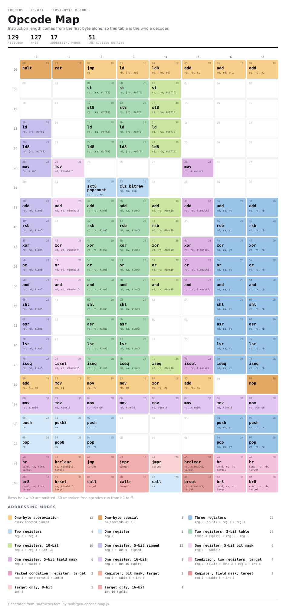

# Fructus

A 16-bit proposed retrocomputer instruction set, and a toolchain that's
complete enough to write code and evaluate how the ISA should be changed.

Ports of gas, gcc, ld, objdump etc are provided.  A minimal libc
(with an O(1) malloc implementation) and tuned
integer math operations for libgcc are provided. Printf with optimized
int-to-decimal.

A simulator is available.

A complete FPGA implementation including interrupts and VGA output is
written, but never tested on hardware. Timing analysis puts it between about
22 and 30 MHz on iCE40, depending on the configuration — the CPU alone or with
the VGA frame buffers beside it, 32K or 64K of memory — and every configuration
is fast enough to share the VGA's 25 MHz clock as a single clock domain. Most
byte codes take two cycles. Full barrel shifter, but no cache, branch
predictor, or mul instruction. Not very pipelined.



The design is RISC-inspired:
- The only memory operations are load, store, push, pop, store-multiple, load-multiple.
- 8 16 bit registers, and all ALU instructions can use all 8.
- Flat 16 bit address space.
- All ALU operations have a regular three-register form, rd = ra * rb
- There's also an immediate form with immediates from -512 to 511: rd = ra * #imm
- For larger immediates the assembler can transparently use a scratch register.
- The stack pointer is a regular register, sp = r6
- The return address is a regular register, lr = r7
- No status flags, but explicit compare-branch and operations that write 0 or 1 to a regular register.
- Modern calling convention. Arguments and return values are passed in registers where possible, including small structs.

But we don't want to pay the typical code density penalty of RISC on a 64k machine
- Compact encodings for two-register forms where rd is ra.
- Compact encodings for smaller and common immediates like -16 to 15, single-bit-set, and common masks.
- One-byte encodings for very popular ALU operations that hard code all three arguments.
- The length of the instructions is 1-3 bytes and the first byte determines the length.
- Still many free opcodes for experimentation eg. instructions for garbage collectors (we already have popcount and clz).
- The intention is that the assembler programmer can code as if all three-register and two-register-imm16
  forms were available, but the tooling selects the shortest possible encoding. For C code, gcc is aware
  of the encoding tradeoffs and selects instructions to match.
- Up to three arbitrary registers can be pushed or popped in a single two-byte instruction for compact
  function prologs and epilogs. Store-multiple and load-multiple can write or read up to three registers
  (repeats allowed) for memcpy, memset, strlen. Their pointer is fixed, as `sp` is for push and pop —
  `stm` stores through `r1` and `ldm` loads through `r2`, each counting up — which leaves all of
  byte 1 for the register list.

It is conceived to run on the
kind of machine a 6502 ran on — a narrow memory bus where every instruction byte
is a cycle you pay for — so the design question behind almost every decision in
here is *what does this cost in bytes*.

The non-interactive SVG opcode map above and the interactive HTML form with per-cell tooltips come from
`npm run map`.

The ALU is strictly two-input, single output. Comparator operations (conditional
branch and the "? 1 : 0" instructions iseq, isset) have a fourth 3-bit
input which selects the condition. Unary operations will be implemented as
binary operations where the second (immediate) input selects the operation.

Right now almost half the opcode space is still free. Some short forms have been specified
that likely aren't worth it and will be removed. The FPGA implementation will provide
input as to which features make sense.

Current ALU instruction forms (those requiring 9 bits take up two opcodes):
- reg, reg, reg - *2-byte* - Any three registers
- reg, reg, imm3 - *2-byte* - Immediate is one of -1, 0, 1, 2, 3, 4, 6, 8
- reg, imm5 - *2-byte* - Immediate between -16 and +15
- reg, immbit5 - *2-byte* - Immediate is any value 1 << n or its bitwise complement
- reg, immask5 - *2-byte* - Immediate is one of the following or their complements: 
  0xc000, 0x3000, 0x0c00, 0x0300, 0x00c0, 0x0030, 0x000c, 0x0003,
  0xf000, 0x0f00, 0x00f0, 0x000f, 0xff00, 0xf0f0, 0xcccc, 0xaaaa
- reg, reg, imm10 - *3-byte* - Immediate is any value between -512 and 511
- reg (implicit in opcode), imm16 - *3-byte* - Any immediate, only for mov and some control flow instructions

Current condition forms (all *2-byte*, but the branch instructions add a third byte for the relative PC offset):
- reg, reg, cond - The usual 8 conditions including overflow. Their inverses are achieved by reversing the two registers
- reg, imm5 - The imm5 selects common constant-condition pairs
- reg, immbit5 - Immediate as above is and-ed with the register and tested for zero (brclr) or non-zero (brset, isset)
- reg, immask5 - Immediate as above is and-ed with the register and tested for zero (brclr) or non-zero (brset, isset)

## The implementation structure

To allow experimentation with the ISA
[`isa/fructus.toml`](isa/fructus.toml) is the single source of truth. It holds
every encoding, every operand type, and what every instruction *does*. The
assembler, the decoder and the simulator are all generated from it or driven by
it, so none of them can drift away from the spec or from each other.

The one hand-maintained view left in it — the opcode map in the header comment —
is checked against the encodings below it by `npm run check`.

It also contains some of the considerations that went into the design so far, so
it's part of the documentation.

## Quick start

You need [customasm](https://github.com/hlorenzi/customasm) (Rust, Apache-2.0)
on your `PATH`:

```sh
just install-deps
cargo install customasm        # or grab a release binary
npm install                    # one dependency: a TOML parser
npm run gen                    # generate build/fructus.asm from the spec
npm test                       # 83 checks, ~800,000 assertions
```

Then assemble and run something. `customasm` takes several input files, so the
generated ruledef goes first:

```sh
customasm -q build/fructus.asm myprog.s -f binary -o build/myprog.bin
npm run sim -- build/myprog.bin --trace
```

```
0000  mov r0, #10          r0=0000 r1=0000 r2=0000 ... r6=fffe r7=0000
0002  mov r1, #0           r0=000a r1=0000 ...
0004  add r1, r1, r0       r0=000a r1=0000 ...
0005  add r0, r0, #-1      r0=000a r1=000a ...
0006  br   ne, r0, #0, 0x0004   r0=0009 r1=000a ...
halted after 33 instructions
```

The registers on each line are the state *entering* that instruction — what it
reads, not what it produced.

### Notation

Three spellings in the assembly language have no opcode behind them. They are
`[[alias]]` entries in `isa/fructus.toml`, not rules in the generator, because
the spec is what defines the language:

| you write | it assembles as | why |
|---|---|---|
| `mov rd, rs` | `or rd, rs, #0` | there is no move opcode; `or` with zero is a copy |
| `sub rd, ra, rb` | `rsb rd, rb, ra` | one subtract opcode, sources swapped |
| `sub rd, ra, #k` | `add rd, ra, #-k` | …and the immediate negated |
| `ld rd, [ra]` | `ld rd, [ra, #0]` | the offset is a field of the encoding, so `#0` is just typing |

The last one covers `ld`, `ld8`, `st` and `st8`. Rewriting happens *before*
form selection, so the shorthand still reaches the shortest encoding —
`ld r0, [r0]` is one byte, the pinned abbreviation at `0x03`.

Disassembly prints the long form in every case except `mov`. A listing read
beside a hex dump should show every field the bytes carry, and an offset field
that is zero is still an offset field.

## What's here

```
isa/fructus.toml      the ISA: encodings, operand types, semantics, rationale
isa/abi.s             the calling convention, as a file that assembles
isa/mos6502.toml      the NMOS 6502 opcode table, for comparison - not part of Fructus
tools/                the toolchain, all driven by the TOML
rtl/                  hardware, generated from the spec - see below
libc/                 a tiny libc, sized for a machine with 64K
snippets/             worked routines, with their byte counts measured
tangerine/            the Microtan monitor ROM
tests/                the test suite
```

### Tools

| | |
|---|---|
| `npm run check` | validates the encoding invariants and the object format, prints the opcode census |
| `npm run gen` | emits `build/fructus.asm`, a customasm ruledef |
| `npm run sim -- <bin>` | runs a flat binary. `--trace`, `--pc`, `--sp`, `--max` |
| `npm run microtan -- <rom>` | runs a ROM on the simulated board |
| `npm run map` | the opcode map: `build/opcodes.html` and `docs/opcodes.svg` |
| `npm run map6502` | the same map for the NMOS 6502: `build/6502.html` and `docs/6502.svg` |
| `npm run rtl` | `rtl/immgen.sv` and `rtl/rhs.sv`, from the spec's value tables |
| `npm test` | everything, `npm run check` included |

Heading for hardware: [docs/fpga-toolchain.md](docs/fpga-toolchain.md) is the
open-source iCE40 toolchain, how to install it and the two things that catch
you out.

### gcc

There is a gas port and a gcc port.  g++ probably works with no exceptions.

- char: 8 bit
- short: 16 bit
- int: 16 bit
- pointer: 16 bit
- long: 32 bit
- long long: 64 bit

The calling convention depends on the arity. `r2` and `r3` are caller-saved
when the function takes an argument in them and callee-saved when it does not —
a static approximation of interprocedural register allocation, using the only
signal that costs nothing to distribute. `isa/abi.s` has the argument, including
the case against.

- r0: caller save
- r1: caller save
- r2: caller save if it passes an argument or returns a value
- r3: caller save if it passes an argument or returns a value
- r4: callee save
- r5: caller save, used for large immediates
- r6: sp, stack pointer
- r7: lr, return address

### rtl/

This is my first (AI-assisted) foray into FPGA design, and still subject to
change. It is a complete CPU — every opcode in the spec, interrupts included —
plus the VGA output in `rtl/video/` (see [docs/vga.md](docs/vga.md)). The
clock speeds quoted below were each measured for one block or configuration at
the time it was added; what the whole system reaches depends on whether the
VGA is in the same FPGA and how much memory is attached.

`rtl/insn.sv` holds the whole instruction in 24 bits, **each byte at its place**
— byte 0 low, as in memory — rather than shifting the newest byte in. `dispatch`
loads an opcode into byte 0 and restarts a two-bit count; `fetch` loads the next
byte where the count points. So every operand field is one slice at one position
from the cycle its byte arrives until the next dispatch: imm10 is `insn[23:14]`,
imm16 `insn[23:8]`, the register fields `insn[10:8]` and `insn[13:11]`. A `view`
output shows the byte on the bus as if already stored, for bytes 1 and 2 only.
Measured with a real SPRAM driving the bus, reading `view` straight into the
datapath costs a fifth of the clock; registering the port addresses from it and
reading the register file from those flops a cycle later is the fastest of the
three placements tried.

Generated, not written. `rtl/immgen.sv` produces the 16-bit immediate right-hand
side for every instruction that has one — the ALU and shift groups, `mov`, the
load and store displacements, `brclr`/`brset`, and the packed branch's
`condimm5` constant — from the instruction register and one control line. 109
LUT4 and three LUT levels on an iCE40 UP5K.

It costs that little because of properties of the *values* in the spec, not of
the circuit: `immbit5` and `immask5` are each sixteen entries plus their exact
complements, and in the same order a nibble shifted by four times the index's
top two bits, so the two are one shifter with one complement layer; and `shift3` is `imm3`
masked to four bits, which is what the shifter does anyway, so there is no
`shift3` table in hardware at all. Both are checked by `npm run check`, which
names the hardware cost when an edit breaks them.

`rtl/rhs.sv` puts **one four-bit microcode field** on top of it, choosing a
register, a constant, or immgen in one of its two readings:

```
 0  r0         4  imm16        8  #0      12  immgen, as condimm5
 1  r1         5  r5           9  #1      13  port B, from the bytes
 2  reserved   6  sp          10  #2      14  #-2
 3  reserved   7  lr          11  immgen  15  #-1
```

The encoding is what makes it nearly free. `src[3]=0` is a register and
`src[2:0]` *is* its number, so `regnum` is wiring; `src[3]=1` reads `src[2:0]` as
a 3-bit **signed** constant, so `konst` is one signal fanned out thirteen ways.
That is why `#-2` and `#-1` sit at 14 and 15 rather than in numeric order. Two
cells more than the four separate control bits it replaces, at the same depth,
for a microcode bit back — and the reserved codes cost nothing to reserve, since
they decode as r2/r3 today and the microcode never emits them. Code 4 was one
of them; it is now the 16-bit immediate for `mov rd, #imm16`, whose `opcode[2:0]`
is a register rather than a column immgen could read, at no extra LUT level.

The constants are exactly what the one-byte abbreviations need, and `npm run
rtl` fails if a new one needs something outside them.

`rtl/lhs.sv` is the other input's register: one four-bit field naming a register
or picking byte 1's rd or ra field. Its generator works out each form's
left-hand register from the spec's semantics and finds its field by decoding
every byte 1; the column decides it everywhere but `call ra`. It once needed a
microcode latch to survive the shifting instruction buffer; on `insn.sv` it is
one line, and a tenth of the clock faster.

`rtl/dest.sv` is the write address, in the same style: a register the microcode
names, or one of four places an instruction carries a register number. The rd
field serves every ALU operation, load, `mov` and unary operation; the ra and
port-B fields exist for the second and third registers of `pop`, and the opcode
field for `mov rd, #imm16`. Codes 8 and 9 mean the same as in `lhs.sv`. Placed
beside a register file, the field mux costs a third of the clock on the write
path — which is still faster than a read through the ALU, but is the next path
in line.

`rtl/alu.sv` is the ALU. The operation is a four-bit microcode field — the spec
forbids decoding it from the opcode — and the generator assigns every
instruction an operation from its `semantics`, failing on any it cannot place.
`iseq` and `isset` are ALU operations, and neither needs a carry.

Branches are decided beside it, not in it. `rtl/compare.sv` takes the same two
operands and answers one bit, `taken`, that never enters the ALU's result;
`rtl/cond.sv` supplies its condition. The packed branch's condimm5 entries are
mirrored onto `imm - R[a]` and need a negate bit as well as cond3: `R[a] < k` is
`not (k <= R[a])`, and cond3 spells `gt` only by exchanging registers. Every
entry is checked against the simulator for all 65536 register values. Measured,
the comparison had set the combined ALU's speed; apart, the ALU is a fifth
faster on its own, and behind the register file both paths sit level at about
26 MHz — where the register read in front of them is what sets the clock.

`rtl/predecode.sv` is the control that belongs to a whole instruction: a
table over the first byte, loaded into flops in the dispatch cycle, giving the
ALU operation and the lhs, rhs, dest and condition sources. The microcode ROM
keeps what changes from step to step. Its rows come from `tools/control.js`,
which holds the rules the lhs, dest, rhs and ALU generators were already using,
so the table and the blocks it drives cannot disagree. It is checked by
executing: every single-step instruction runs on the simulator and through the
RTL with nothing but predecode's selects, and the written register and value,
or the branch decision, must match. Measured behind a real SPRAM, the table
costs 83 cells, its dispatch path runs at three times the execute step's rate,
and the step is no slower than with idealised select flops.

`rtl/ucode.sv` is the microcode ROM and its sequencer: a synchronous ROM
addressed by the opcode on the bus when a step dispatches, and by the word's
own `next` otherwise. Because predecode has already chosen every select, the
ALU instructions need almost nothing from it — a two-byte one is an entry word
that fetches byte 1 and a shared step that writes the result while dispatching
the next opcode, so every ALU opcode shares its whole routine. It runs every
instruction in the spec, `brk`, `rti` and hardware interrupts included; the free
opcodes go to a trap word.

`rtl/cpu.sv` joins the blocks into something that runs programs, with the
memory outside behind a synchronous read. It is checked by running them:
random programs of every implemented form execute on the RTL and the simulator,
and at every dispatch the pc and all eight registers must match and each
instruction must take exactly as many cycles as it has bytes — the simulator's
cost model, confirmed rather than assumed. Measured behind a real SPRAM it runs
at 21.9 MHz, limited by the execute step rather than the ROM, with routing two
thirds of the critical path.

`rtl/unary.sv` is the unary block, in two pairs and a fifth. `sxt8` and `bitrev`
are wiring and share opcode 0x32 with `clmul`, the carry-less product of a
register's two bytes, which is two LUT levels and 53 cells and measured no
slower than registering it; `clz` and `popcount` are the deep ones and share 0x33,
where their result is registered and the instruction takes a cycle more than its
length — `extra_cycles` in the spec, which the simulator counts. The microcode's
entry points are per opcode, which is why the split falls on one. Measured, it
took the processor from 21.9 to 23.7 MHz, nearly all of what removing the unary
block altogether would buy, for 25 LUTs. The selector is bits of the
right-hand side the ALU already reads — one per pair, and a second for the
opcode that holds a third operation: the unary forms sit in the imm3 columns
and immgen turns their index into a value, so no selector lines run from decode.
There is no `zxt8`: `and rd, rd, #0x00ff` is two bytes through immask5, and
between registers `and rd, ra, #255` is three through imm10. `popcount`'s adds
are written as gates, so no carry chain is forced on it; the carry chains it had
cost more in routing than its size suggested.

Port B's register number comes off the instruction bytes rather than out of
immgen, so the register file's read overlaps the immediate unit instead of
waiting for it — four LUT levels and 38 MHz against six and 31, with a real 8×16
file behind it. That is also why nothing checks immgen at `+6`/`+7`: nothing reads
it there, and an `x` reaching the ALU means the microcode asked for an immediate
from an instruction that has none.

The suite regenerates the file and fails if the committed copy has drifted, then
runs 414,288 vectors and a clocked model of the instruction register — built
from the same TOML by a path sharing no code with the generators — against them
under `iverilog`, skipping if `iverilog` is absent.
The unary operations are swept over their *whole* input space, all 65536 values
each, because a sampled sweep misses exactly the interesting inputs: dropping
popcount's carry-free top bit is wrong for one input in 65536, `0xffff`.
All sixteen source codes are swept, the reserved ones included, so a change
that gives them a meaning has to say so there rather than silently altering
what they do.
It also decodes real bytes with `tools/decode.js` to confirm that
`{byte1[7:6], opcode[0]}` really is ALU port B for every three-operand form,
which is what the `+6`/`+7` output claims.

`tools/isa.js` reads the spec; `tools/decode.js` turns bytes back into
operands; `tools/sim.js` executes the `semantics` expressions. The generator and
the decoder share only the code that reads an `encoding` string — below that
they are independent implementations of the same table, going in opposite
directions.

### Tests

The suite is layered, and each layer catches something the one below it cannot.

- **It assembles.** Proves an encoding exists. Says nothing about whether it is
  the right one.
- **It round-trips.** `tests/roundtrip.mjs` assembles, decodes with
  `tools/decode.js`, re-assembles, and compares bytes. Two independent readings
  of the encoding checked against each other — this catches a field gathered in
  the wrong order or a signed immediate read unsigned, which validate clean and
  round-trip wrong.
- **It computes the right answer.** `tests/sim-check.mjs` runs the actual
  assembled snippets on the simulator against exact BigInt arithmetic — not
  another transcription of the algorithm.
- **The board works.** `tests/microtan-check.mjs` checks reset, the ROM window,
  the keyboard handshake and the display.
- **It survives every placement.** `tests/libc-check.mjs` runs `libc/` against
  a reference built from a snapshot rather than a second copy of the algorithm,
  sweeping every overlap of source and destination in a window, at two bases and
  across the 0x8000 sign boundary. Two things the sweep depends on are asserted
  rather than assumed: no placement may leave the window, and the fill may not
  resemble a shifted copy of itself — a fill with a period, or merely with runs
  of equal bytes, makes a wrong-direction copy invisible. It also checks which
  loop `memmove` picked, since a version that always copies downwards writes
  exactly the right bytes and is three times slower.
- **It is still as fast as the comment claims.** The `memcpy` ladder in
  `snippets/memcpy.s` is executed at sixteen lengths and its cost is measured,
  by differencing two buffer sizes so the setup cancels and the loop alone
  shows. A rung that gets slower fails the suite. Prose about performance is the
  thing in this repo most likely to go quietly stale.

`tests/fpadd-check.mjs` and `tests/fpsub-check.mjs` are hand-written mirrors of
two snippets. They predate the simulator and are kept for their exhaustiveness —
a 47-million-combination sweep of two carry conditions, past what running real
code case by case reaches.

## The machine

`tools/microtan.js` puts the core on a board shaped like the Microtan 65, a 1979
single-board 6502 from Tangerine Computer Systems:

```
0x0001           keyboard port, one byte
0x0200 - 0x03ff  screen, 32 x 16 characters, row major
0xfc00 - 0xffff  ROM, 1K, read only
0xfffd           where the CPU starts
```

The reset address is three bytes from the top of memory and `jmp target` is a
three-byte instruction, so the vector and the code that uses it are the same
three bytes.

A key press is delivered to `0x0001` only when that byte reads zero — the
handshake the monitor completes by clearing it after a read. ROM writes are
dropped and counted, because a monitor that stores into its own ROM has a bug
and the count is the only evidence it will leave.

```sh
make boot          # assemble tangerine/monitor.s and run it
```

Interactive mode takes over the terminal; `--keys "..."` runs the same machine
headless and dumps the screen, which is how the tests drive it.

## Design principles

**Instruction length comes from the first byte alone.** The decoder is a
256-entry table and the fetch unit never looks ahead. `tools/decode.js` asserts
it, which the assembler structurally cannot — it only ever goes the other way.

**Displacements count bytes and are never scaled by access width**, so that
a V8-style or SOM virtual machine can tag pointers in the low bit. Field offsets come out odd (`ld rd, [rp, #-1]`),
and a scaled displacement could not express them at all.

**There is no carry flag.** The carry out of a 16-bit add is recoverable from the
result — `sum < A` — so 32-bit arithmetic is add, compare, conditionally bump.
See `snippets/add32.s`.

**`r5` belongs to the assembler.** Any immediate that does not fit its
instruction expands through it, so no function can promise to preserve it. This
is MIPS's `$at`, and it costs what MIPS's does.  It can be disabled for gcc
and assembler authors who are familiar with the restrictions on immediate range.

The rule that follows is **don't keep anything in `r5` that has to survive** —
not "check whether this particular instruction expands". Whether `lsr r5, lr, #14`
expands depends on which forms exist for that mnemonic, which is not something a
reader should have to know. So it is enforced rather than remembered: `npm test`
assembles every file in `snippets/` and `libc/` against the `--noat` ruledef,
which omits every rule that borrows the scratch. A file that assembles there
cannot contain an expansion, and `r5` in it is an ordinary register.
`isa/abi.s` is the one exception, and expands exactly once on purpose to show
what it costs — the suite pins the count at one.

**Unaligned 16-bit access is free**, with no fault and no penalty visible to
software, which is what lets the stack pack byte arguments without padding.

**The exception instructions are the lowest opcodes** — `brk` at `0x00`, `halt`
at `0x01`, `rti` at `0x02` — so erased memory, an unwritten ROM and a wild jump
into a zeroed page all trap to the handler with the faulting address in `lr`,
where a monitor can print it. `nop` is at `0x87`, as far from them as the
one-byte region reaches.

**Current assumption: A taken relative branch costs one cycle more than its length**, for the add
that produces `pc + off`; an absolute `jmp`, `call` or `ret` costs nothing
beyond its bytes, because the target is latched as it is fetched or read
straight from the register file. This is the 6502's behaviour — a branch is two
cycles falling through and three when taken, while `JMP` absolute is exactly
three — and it is what makes a longer unrolled loop worth anything once the
instruction mix is fixed. The simulator does not keep a list of which
instructions are which: `pc = pc + off` mentions `pc` on the right and is
therefore relative, `pc = target` does not.

## Possible enhancements

The opcode map makes the gaps visible, and two of them are worth naming. Neither
is implemented; they are here so the space does not get spent on something else
by accident. (Two earlier entries here, a multi-register store and an indexed
`ld rd, [ra, rb]`, have since become `stm`/`ldm` and the `[ra, rb]` forms of
`ld`, `ld8`, `st` and `st8`.)

### `rsb` with a `#1<<n` immediate

Slot `+4` of every ALU group is the immbit5 slot, and four of the eight
operations now use theirs — `add` (0x3c), `xor` (0x4c), `or` (0x54), `and`
(0x5c). `rsb` (0x44) is the one left that could plausibly want it:
`rsb rd, rd, #1<<n` computes (2ⁿ − rd), plausible for mirroring an index, and
no routine here has wanted one yet. The shifts leave theirs free because a
shift distance is four bits.

One opcode each and no new hardware — the 4-to-16 decoder is already built for
the other three. Cheap enough that the question is whether they earn their line
in the documentation, not whether the map can afford them.

The other three free `+4` slots — `shl`, `asr` and `lsr` at 0x64, 0x6c and 0x74
— are free for a reason and should stay that way. A shift count is masked to
four bits, so `1<<4` and everything above it reads as a shift of zero. immbit5
is meaningless there.

### One unused one-byte encoding

0x86. The one-byte region is sixteen slots: `brk`, `halt` and `rti` at the
bottom, `nop` at 0x87, and eleven pinned abbreviations — `add r0, r0, #1`,
`mov r0, r1`, `mov r0, #0` and their neighbours at one byte instead of two.

`mov r0, #0` (0x83) is there for the 65C02's reason: `STZ` was one of that
part's most valuable additions because clearing a location is the commonest
thing a program does that the 6502 had no short way to say. Zeroing a register
is the same observation one level in — loop counters, accumulators, null
pointers, cleared flags — and `r0` is where a return value and a first argument
live.

**The last slot should not be spent on a guess.** It is worth exactly the
frequency of the operand pattern it pins, and that is a question about real
code rather than about the instruction set. Now that gcc works, the way to spend
it is to compile a corpus, count, and pin the winner.

### Not an opcode: a zero page, and a stack guard in the I/O page

These two are about the memory map, and they are why `tools/fpga-system.sv`
puts its I/O page at 0x0200.

**A zero page.** A mode could pin a register at zero, so that `[rz, #imm10]`
reaches low memory directly, with no base register to set up, as the 6502's
zero page did. `imm10` is signed, so that is the first 512 bytes, and those
are kept free for it; the I/O page starts just above them.

**A stack guard.** The stack grows down towards the I/O page. If writing any
of the page's top 16 registers, 0x02f0–0x02ff, raised an interrupt, a push
past the bottom of the stack would trap. It is a debugging aid, not
something to recover from: the handler can report the overflow, and it has
a stack to do it on, since interrupt entry moves `sp` to `shadow_isp`. The
guard is 16 bytes, so a frame larger than that could step over it with an
`sp`-relative store and not trap.

## Status

The instruction set is settled enough to write real code against, and the
snippets in `snippets/` are real code. Open:

- `clz`, `bitrev` and `popcount` are marked TENTATIVE in the spec.
- The monitor in `tangerine/` is barely started.
- Nothing checks that a call site and its callee agree about arity. The fix is
  a `.args` declaration the assembler and linker verify; `isa/abi.s` describes
  it and why it is not written yet.

## License

ISC.
